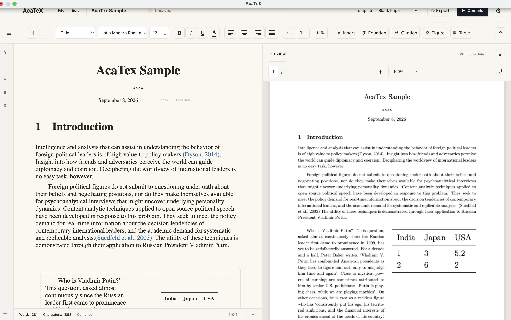

<p align="center">
  
</p>

<h1 align="center">AcaTex</h1>

<p align="center">
  <strong>Write visually. Typeset with LaTeX.</strong>
</p>

<p align="center">
  A visual, structured academic writing environment powered by LaTeX.
</p>

<p align="center">
  <strong>Public Preview · v0.3 · macOS · Apple Silicon</strong>
</p>

<p align="center">
  Supports English and Chinese academic writing.
</p>

<p align="center">
  <a href="#中文介绍">中文介绍</a>
</p>

<p align="center">
  <a href="https://github.com/DarcyLuai/AcaTeX/releases/latest">
    
  </a>
</p>

---

## See AcaTex 

<p align="center">
  
</p>

<p align="center">
  <strong>Write visually. Organize structurally. Let LaTeX handle the typesetting.</strong>
</p>

---

## 👀 What is AcaTex?

AcaTex is a visual academic writing environment that keeps LaTeX underneath — without making LaTeX source code your primary writing interface.

Write your paper like you would in a modern word processor.

Add visually:

- Sections
- Equations
- Citations
- Footnotes
- Figures
- Tables
- Structured layouts
- References

AcaTex handles the corresponding LaTeX structure, compilation, bibliography processing, and PDF generation in the background.

No need to begin with:

```latex
\section{}
\begin{equation}
\begin{figure}
\cite{}
\label{}
\ref{}
```

**Just write.**

---

## Why AcaTex?

LaTeX is excellent at typesetting.

Writing LaTeX is not always excellent at writing.

A normal academic document might contain:

```latex
\section{Theory}

Previous research suggests that...

\begin{equation}
P(D)=(1-p)[q_N+(q_L-q_N)\pi_L]
\end{equation}

As argued by \textcite{fearon1995}...
```

AcaTex lets you work with what those commands actually mean:

```text
Theory

Previous research suggests that...

Equation 1

Fearon (1995)
```

For example:

```math
P(D)=(1-p)\left[q_N+(q_L-q_N)\pi_L\right]
```

can be inserted visually while LaTeX still handles the final mathematical typesetting.

> **You decide what the document contains. AcaTex handles how that structure becomes LaTeX.**

---

# ✨ What's New in v0.3

This update focuses on real-world LaTeX template compatibility, academic reference workflows, direct document manipulation, and reliability.

AcaTex can now detect additional typesetting requirements in complex templates and install trusted compatibility components on demand — without requiring a full TeX Live or MacTeX installation.

### On-Demand Typesetting Components

AcaTex now includes a compatibility component system for complex and legacy LaTeX templates.

When a template requires additional typesetting resources, AcaTex can:

- Detect missing dependencies

- Match them with trusted compatibility components

- Show download and installed size before installation

- Download components on demand

- Verify package signatures and SHA-256 integrity

- Install components locally

- Recheck template compatibility automatically

- Use installed components offline

Common English, Chinese, mathematical, bibliography, figure, and table support remains included with AcaTex.

Optional components are only downloaded when needed.

### Improved Complex Template Compatibility

Template importing has been improved for more complex academic documents, including book and thesis templates.

AcaTex now handles more:

- Custom `.cls`, `.sty`, `.cfg`, and `.bst` files

- Book and thesis structures

- Multi-file LaTeX projects

- `\input` and `\include`

- Conditional XeTeX dependencies

- Legacy graphics workflows

- Older academic packages

- Chinese thesis templates

Unsupported template structures are preserved where possible rather than silently removed.

The compatibility system has been tested with real-world university thesis templates and can resolve additional dependencies without installing a complete TeX distribution.

### Online Academic Reference Search

References can now be searched directly inside AcaTex.

Current online metadata sources include:

- Crossref

- OpenAlex

Search by:

- Paper title

- Author

- Keywords

- DOI

A reference found online can be added directly to the local Reference Library and used for Citation.

Once added, references remain available offline.

### More Natural Drag & Drop

Direct document manipulation has been expanded.

AcaTex now supports Word-like movement of document content, including:

- Selected text

- Citations

- Figures

- Tables

The editor shows the actual insertion position while dragging.

The existing Document Map drag-and-drop workflow remains available for larger structural changes.

### Improved Document Map

Document Map has been refined for longer academic documents.

Improvements include:

- Clearer section grouping

- Collapsible sections

- Independent sidebar scrolling

- Better active-section navigation

- Cleaner Citation presentation

- Improved synchronization with direct editor dragging

### Crash Recovery

AcaTex now includes local crash recovery.

Recovery snapshots are maintained independently from normal Save and Autosave.

If AcaTex closes unexpectedly, recent unsaved work can be restored when the application is reopened.

Recovery data remains local.

## Compatibility Components

Optional typesetting components can be managed from:

**Settings → Typesetting Components**

Users can:

- View available components

- Install components

- Check for updates

- Verify installed components

- Use installed components offline

AcaTex does not install a complete multi-gigabyte TeX distribution by default.

The goal is to provide the common academic writing environment out of the box while downloading uncommon compatibility resources only when they are actually needed.

## Fixes and Improvements

This release also includes:

- Fixed Compatibility Pack downloads from GitHub Releases

- Improved package registry and cache handling

- Improved GitHub Release asset handling

- Improved template dependency detection

- Improved XeTeX conditional dependency analysis

- Improved legacy graphics compatibility

- Improved Figure caption placement

- Improved compiler warning presentation

- Improved Citation appearance in Document Map

- Improved template import diagnostics

- Various UI, stability, and typesetting fixes

## Download

AcaTex v0.3.0 currently supports:

**macOS · Apple Silicon**

Download the `.dmg` attached to this release.

1. Open the downloaded `.dmg`

2. Drag AcaTex into `Applications`

3. Launch AcaTex

The macOS build is signed and notarized for external distribution.

AcaTex remains in Public Preview. Bug reports, unusual LaTeX templates, and feature suggestions are welcome.

---

# Changes in v0.2

Major improvements include:

- Structured 50/50, 70/30 and related visual layouts
- Better layout-aware Figure and Table generation
- Document title, author and date controls
- Hide-date support
- Normal explanatory footnotes
- Citation page locators
- Improved Chicago Author-Date rendering
- Improved citation save/reopen behavior
- Precise citation drag insertion feedback
- Improved Document Map navigation
- Improved section and object dragging
- Functional text colors
- Improved figure numbering/caption separation
- Improved table numbering/caption/label separation
- Improved autosave behavior
- Improved template compatibility
- UI and macOS icon polish
- Numerous stability and typesetting fixes

---

# Roadmap

Future versions may continue to expand:

- Custom template compatibility
- Cross-references
- More advanced structured layouts
- Better editor ↔ PDF synchronization
- Reference workflows
- Academic metadata search
- Stability and performance
- Import/export compatibility
- Additional platform support

The roadmap is intentionally flexible.

AcaTex will evolve based on real-world use rather than feature count alone.

---

# Feedback

Found a bug?

Have a strange `.tex` file?

Want AcaTex to support a particular academic workflow?

Have an idea that would make academic writing less painful?

**Open an Issue.**

Bug reports, compatibility reports, and feature suggestions are welcome.

---

# Source Code

This repository currently hosts:

- AcaTex releases
- Documentation
- Issue tracking
- Feature requests
- Community feedback

The AcaTex desktop application's core source code is currently **proprietary and is not included in this repository**.

---

# The Idea Behind AcaTex

LaTeX solved an important problem:

> **Authors should describe the structure of a document instead of manually typesetting every page.**

AcaTex asks one more question:

> **What if authors didn't have to describe that structure in code?**

That's the experiment.

**Write visually. Typeset with LaTeX.**

---

# 中文介绍

> **可视化写作，使用 LaTeX 排版。**

**AcaTex 是一款由 LaTeX 驱动的可视化结构化学术写作工具。**


AcaTex 希望保留 LaTeX 的高质量排版能力，同时把论文写作重新变成一种更加直观的可视化体验。

你可以通过界面直接处理：

- 标题与多级章节
- 正文
- 数学公式
- Citation
- 参考文献
- 脚注
- 图片
- 表格
- 多栏结构
- 文档导航
- 字体与格式

而 LaTeX 代码生成、Tectonic 编译、参考文献处理以及 PDF 排版由 AcaTex 在后台完成。

> **你负责论文写什么，AcaTex 负责它怎么排。**

<p align="center">
  <a href="https://github.com/DarcyLuai/AcaTeX/releases/latest">
    
  </a>
</p>

---
## v0.3 有什么新功能和改进？
AcaTex v0.3.0 是第三个 Public Preview 版本。

本次更新主要集中在复杂 LaTeX 模板兼容、学术文献工作流、直接编辑体验以及可靠性。

AcaTex 现在可以在导入复杂模板时检测额外的排版依赖，并根据需要下载安装经过验证的兼容组件，而不需要用户安装完整的 TeX Live 或 MacTeX。

## 新增功能

### 按需排版组件

AcaTex 现在加入了新的兼容组件系统。

导入复杂或较旧的 LaTeX 模板时，AcaTex 可以：

- 自动检测缺失依赖

- 匹配对应的官方兼容组件

- 安装前显示下载大小与安装后占用

- 按需下载组件

- 验证签名与 SHA-256 完整性

- 自动安装到本地

- 安装完成后重新检查模板

- 安装后完全离线使用

常用的英文、中文、数学公式、参考文献、图片与表格能力仍然随 AcaTex 提供。

只有不常见的兼容组件才需要额外下载。

### 更强的复杂模板兼容

v0.3 改进了对书籍、毕业论文和复杂学术模板的支持。

包括：

- 自定义 `.cls`、`.sty`、`.cfg` 与 `.bst`

- Book / Thesis 文档结构

- 多文件 LaTeX 项目

- `\input` 与 `\include`

- XeTeX 条件依赖

- 旧式图片工作流

- 较老的学术宏包

- 中文学位论文模板

对于暂时无法完全可视化理解的 LaTeX 结构，AcaTex 会尽可能保留原始内容，而不是直接丢弃。

新的兼容机制已经使用真实的高校学位论文模板进行测试，可以在不安装完整 TeX 发行版的情况下补充所需依赖。

### 在线学术文献搜索

现在可以直接在 AcaTex 中搜索学术文献。

目前支持：

- Crossref

- OpenAlex

可以通过：

- 论文标题

- 作者

- 关键词

- DOI

搜索文献。

找到文献后可以直接加入本地 Reference Library，并立即用于 Citation。

文献添加到本地后无需联网即可继续使用。

### 更自然的拖拽编辑

v0.3 进一步增强了正文中的直接操作。

现在可以像现代文字处理软件一样拖动：

- 选中的文字

- Citation

- 图片

- 表格

拖动过程中会显示内容真正插入的位置。

原有的 Document Map 拖拽功能仍然保留，适合进行更大范围的论文结构调整。

### Document Map 改进

Document Map 针对长篇学术文档进行了进一步优化：

- 更清晰的章节分组

- 章节折叠

- 独立滚动

- 更好的当前章节定位

- 更协调的 Citation 显示

- 与正文直接拖拽实时同步

### 崩溃恢复

AcaTex 现在加入了本地崩溃恢复功能。

Crash Recovery 与普通保存和自动保存相互独立。

如果 AcaTex 意外退出，可以在重新打开软件时恢复最近的未保存内容。

恢复数据仅保存在本地。

## 排版组件

可以通过：

**设置 → 排版组件**

管理可选的兼容组件。

用户可以：

- 查看可用组件

- 安装组件

- 检查更新

- 验证已经安装的组件

- 离线使用已经安装的组件

AcaTex 不会为了兼容所有 LaTeX 模板而默认安装一个数 GB 的完整 TeX 发行版。

我们的目标是：

**常用能力开箱即用，不常用的兼容能力按需安装。**

## 修复与改进

本版本还包括：

- 修复 GitHub Releases 兼容组件下载

- 改进组件 Registry 与缓存机制

- 改进 GitHub Release Asset 下载处理

- 改进模板依赖检测

- 改进 XeTeX 条件依赖分析

- 改进旧式图片兼容

- 修复 Figure Caption 位置问题

- 改进 LaTeX 编译 Warning 显示

- 改进 Document Map 中 Citation 的视觉效果

- 改进模板导入错误诊断

- 多项 UI、稳定性与排版修复

## 下载

AcaTex v0.3.0 当前支持：

**macOS · Apple Silicon**

请下载本 Release 中的 `.dmg`。

1. 打开下载的 `.dmg`

2. 将 AcaTex 拖入 `Applications`

3. 启动 AcaTex

macOS 版本已经完成签名与 Apple Notarization。

AcaTex 目前仍处于 Public Preview 阶段。

如果你遇到 Bug、特殊 LaTeX 模板兼容问题，或者有新的功能建议，欢迎通过 GitHub Issues 反馈。


## 本地优先

AcaTex 的核心写作流程可以在本地完成：

- 写作
- 保存
- 自动保存
- LaTeX 编译
- Citation
- 参考文献
- PDF
- 图片
- 表格
- 文档结构

你的论文不应该因为没有网络而无法继续写。

---

## 下载

当前版本：

**AcaTex v0.2**

支持：

**macOS · Apple Silicon**

请前往本仓库的 **Releases** 下载最新 `.dmg`。

---

## 当前状态

AcaTex 仍然处于 **Public Preview**。

复杂的 LaTeX 宏包、自定义命令、特殊 `.cls/.sty` 文件以及部分边缘场景仍可能存在兼容性问题。

如果遇到 Bug，欢迎提交 Issue。

---

## 关于源代码

本仓库目前用于：

- AcaTex 版本发布
- 文档
- Issue 追踪
- 功能建议
- 用户反馈

AcaTex 桌面应用核心代码目前暂未公开。

---

## AcaTex 的想法

LaTeX 的一个重要思想是：

> **作者应该描述文档的结构，而不是手工调整每一页的排版。**

AcaTex 想再往前一步：

> **如果作者连描述这些结构的代码都不需要写呢？**

这就是 AcaTex 正在尝试的事情。

**可视化写作，使用 LaTeX 排版。**
